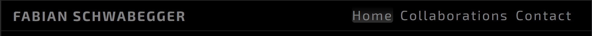
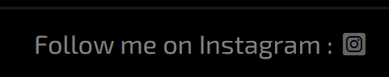

# Fabian Schwabegger

[Click on this link to visit the website](https://obiwanbonobi.github.io/PP1/)

# Content

- [Introduction](#introduction)
- [User experience](#user-experience)
- [My vision for the website](#my-vision-for-the-website)
- [Features](#features)
   * [Navigation](#navigation)
   * [Footer](#footer)
- [Introduction](#introduction)
- [Introduction](#introduction)
- [Introduction](#introduction)
- [Introduction](#introduction)
- [Introduction](#introduction)

# Introduction

I embarked on the journey of creating a website for my partner, who is a graphic designer, with a profound sense of purpose. Recognizing his extraordinary talent as a graphic designer, I wanted to offer a dedicated platform that would not only honor his work but also provide a showcase for his remarkable skills. This website stands as a testament to our shared commitment to creativity and design excellence. It's a space where his artistic endeavors can shine and captivate, where clients can discover the transformative power of design. 

By crafting this online presence, I aim to assist in amplifying his reach and connecting him with a broader audience that appreciates the craftsmanship and ingenuity he brings to every project. It's a digital canvas where his talents can truly flourish, and I'm thrilled to contribute to this creative endeavor that continues to inspire us both.

## User experience

I've meticulously crafted this online space to ensure a seamless and engaging user experience. Ultimately, I want visitors to my website to feel inspired, informed, and connected. Whether they're seeking my partner's services, admiring his work, or just exploring the world of graphic design, I aim to provide an exceptional and memorable user experience that leaves a lasting impression.

## My vision for the website

The layout is intuitive and visually appealing, making it easy to navigate through and explore his work. I've optimized the site for all devices, ensuring that whether on a desktop, tablet, or smartphone, the content remains accessible and aesthetically pleasing. I've paid close attention to loading times to keep the user engaged and prevent frustration. 

Whether it's the captivating visuals or the carefully crafted text, I've strived to create a harmonious blend that provides valuable information. In addition, I've included a user-friendly contact form, and Fabian is committed to a swift response. I've placed a strong emphasis on accessibility to ensure that everyone, regardless of ability, can enjoy the site without barriers.

# Features

### Navigation

The navitagion bar is always visible at the top of each page, for easy navigation. It includes :
- on the left side are Fabi's initials on small screens and his full name on bigger screens
- on the right side is a burger icon on small screens and the full navigation menu on bigger screens
- I gave the navigation bar a barely visible line underneath to show a difference between navigation bar to the main section

### Footer

The footer is at the bottom of each page and it includes a link to Fabian's instagram account. I gave the footer bar also a barely visible line above to show a difference between the footer and the main section.

